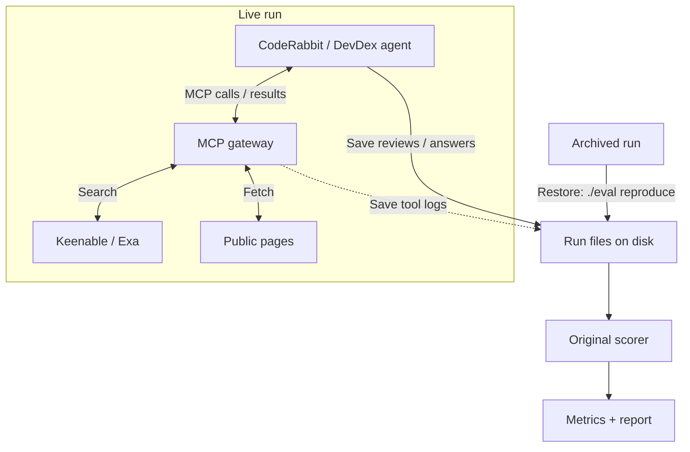

# Keenable Eval For CodeRabbit

[CodeRabbit](https://www.coderabbit.ai/) is an AI agent that reviews pull requests and flags bugs. It [uses Exa Deep Search](https://exa.ai/customers/coderabbit) to verify findings against external documentation.

This repository compares [Keenable](https://keenable.ai/) and [Exa](https://exa.ai/) for CodeRabbit reviews and a separate documentation-retrieval task:

- CodeRabbit reviews: [Martian](https://github.com/withmartian/code-review-benchmark).
- Agent documentation retrieval: [DevDex](https://github.com/firecrawl/benchmark-devdex).

## Results

**Keenable shows no clear advantage across the two benchmarks.**

- **Martian:** Keenable scored 59.8% Core F2 versus Exa’s 58.6%.
- **DevDex:** Keenable found 9/30 reference URLs versus Exa’s 10/30, with median task times of 17.2 s and 20.3 s, respectively.

### Martian: search-focused reviews

Start with Martian because [CodeRabbit reports results on it](https://www.coderabbit.ai/blog/coderabbit-tops-martian-code-review-benchmark). From its 50 offline PRs, I manually selected 11 with plausible dependence on external documentation and reviewed each once in four modes.

| Search | Reference issues found | Unmatched findings | Core F2 |
|---|---:|---:|---:|
| Native | 28/47 | 15 | 60.6% |
| None | **30/47** | 20 | **63.0%** |
| Keenable MCP | **30/47** | 33 | 59.8% |
| Exa Auto MCP | 28/47 | 23 | 58.6% |

*Core F2 = 5 × found / (5 × found + 4 × missed + unmatched).*

Keenable found:

- **2 more reference issues** than native search or Exa (30 vs 28).
- **The same total as no search** (30), with four different matches gained and four lost.
- **More unmatched findings:** 18 more than native, 10 more than Exa and 13 more than no search.
- **Useful issues outside the reference list**, including a privacy leak and unnecessary Salesforce token refreshes; others were duplicates or cleanup suggestions.

**Note on benchmark contamination:** saved Keenable responses exposed existing benchmark PR reviews in at least **3 of the 11 tasks**. These were copies of the same tasks, not unrelated benchmarks:

- **Cal.com 11059:** [an existing review](https://github.com/AI-Code-Review-Evals/claude_code-cal_dot_com/pull/7) discussed the missing fetch timeout and shared-secret comparison, also flagged in this run.
- **Keycloak 33832:** [an existing review](https://github.com/AI-Code-Review-Evals/claude_code-keycloak/pull/3) discussed integer truncation, sequence-length validation and weak round-trip tests, overlapping this run's findings.
- **Sentry 93824:** search fetched public benchmark copies, including [another agent's review PR](https://github.com/AI-Code-Review-Evals/claude_code-sentry/pull/6).

The question is whether Keenable shows a clear improvement. These results show none, so this limitation does not change the conclusion. [Evidence and other limitations](docs/martian-provenance.md#search-focused-extension).

### Additional Martian pilot

I also tested 10 of the 50 offline PRs, limiting the sample to fit the available time and budget.

| Search | Reference issues found | Unmatched findings | Core F2 |
|---|---:|---:|---:|
| Native | 13/28 | 22 | 44.2% |
| None | **18/28** | 21 | **59.6%** |
| Keenable MCP | 16/28 | 19 | 54.4% |
| Exa Auto MCP | 13/28 | 27 | 42.8% |

Eight tasks were screened as mainly repository-local. Keenable scored above native and Exa but below no search; this is a different task mix, not evidence that enabling search itself caused the difference.

### DevDex: documentation retrieval

[DevDex](https://github.com/firecrawl/benchmark-devdex) checks whether an agent retrieves the reference documentation URL among its first 10 citations. I ran the same Claude Opus 4.8 agent on 30 questions per provider, once each.

| Search | Reference URLs found | Median task time |
|---|---:|---:|
| Exa Auto | **10/30** | 20.3 s |
| Keenable Pro | 9/30 | **17.2 s** |

Keenable found one fewer reference URL and had a lower median task time. This measures URL retrieval, not answer correctness; different agent queries mean time is not a pure provider-latency comparison.

## How to run

Requires Docker with Compose 2.24+.

### Reproduce recorded results

1. Clone the repository and enter it:

   ```sh
   git clone https://github.com/Alpus/keenable-search-eval.git
   cd keenable-search-eval
   ```

2. Rebuild the published results:

   ```sh
   ./eval reproduce
   ```

3. Read the verified reports in `runs/reproduced/`.

### Run fresh experiments

1. Run `./eval setup`. Fill `.env` with `GITHUB_TOKEN`, `KEENABLE_API_KEY`, `EXA_API_KEY` and `ANTHROPIC_API_KEY`. The accounts need [the required permissions and credits](docs/usage.md#fresh-runs).
2. Run `./eval run-all` to prepare private repositories, MCP tokens and the HTTPS tunnel.
3. When prompted, follow `.gateway/coderabbit-setup.md` to install CodeRabbit, save both MCP connections and assign the repositories to a Review scope. Follow the [dashboard checklist](docs/usage.md#unavoidable-coderabbit-dashboard-steps) for exact settings.
4. Confirm settings and quota in the terminal. Keep Docker and the command running while it executes and grades both benchmarks.
5. Read reports in `runs/<run_id>/`.

## Details

### Commands

| Action | Command |
|---|---|
| Inspect resolved inputs / preview schedule | `./eval config CONFIG` / `./eval plan CONFIG` |
| Run or resume one configured, quota-approved suite | `./eval run CONFIG` |
| Run all with custom presets | `./eval run-all DEVDEX_CONFIG MARTIAN_CONFIG CONTROLS_CONFIG` |
| Inspect progress / stop containers | `./eval status` / `./eval stop` |
| Rebuild a current run's report / verify code | `./eval report RUN_ID` / `./eval check` |

### Configure an experiment

1. Copy a `configs/` preset and assign a new run ID.
2. Set models, search modes, limits, seed and repeats. Protocol changes require smoke-test qualification; see [configuration requirements](docs/usage.md#quota-and-configuration).
3. Inspect resolved inputs with `./eval config CONFIG` and preview tasks with `./eval plan CONFIG` before running.

Inputs and evidence are saved in `runs/<run_id>/`. Fresh Martian presets allow 10 concurrent reviews and at most 10 review events per hour. DevDex runs sequentially.

### Resume an experiment

1. Check whether the original runner is still active before starting another command.
2. Preserve the run files and configuration, resolve the interruption, then repeat the original command. Follow the [resume checklist](docs/usage.md#resume-or-handoff) for uncertain reviews or grading failures.

For runs that must survive tunnel restarts, set a stable `PUBLIC_MCP_URL` before the first launch.

### Architecture and extension

Add benchmarks through `src/search_eval/suites/` and the registry in `core.py`, using existing task kinds. [File structure](docs/architecture.md) · [Full commands and methodology](docs/usage.md).



The runner saves configuration, reviews/answers, tool logs and judge responses. CodeRabbit uses this gateway only in MCP modes; fetch uses my shared page reader.

`./eval reproduce` restores the archived files and rebuilds scores and reports.
