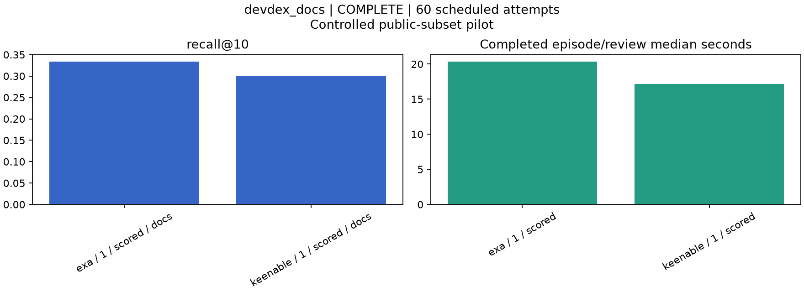

# Developer Search Eval

Compare Keenable and Exa on developer-documentation retrieval, and test search configurations in CodeRabbit reviews. Install Docker with Compose, clone this repository, then run `./eval reproduce` to rebuild the measured results without API keys. Run `./eval check` to verify the implementation. [Commands and live setup](docs/usage.md) · [Architecture](docs/architecture.md).

**Measured:** 30 documentation questions per provider, the same Claude Opus 4.8 agent, one repeat. Exa found the reference source on 10/30 tasks; Keenable on 9/30. Median episode: 20.3s versus 17.2s. This pilot does not show a Keenable quality advantage. The main CodeRabbit comparison has not run.

Both suites retain their original scorers. DevDex measures reference-URL recall@10 and MRR@10. Martian measures Core F2, precision and recall. Timing and completion are separate. These are public-subset pilots, not official leaderboard submissions or proof of customer revenue impact.
