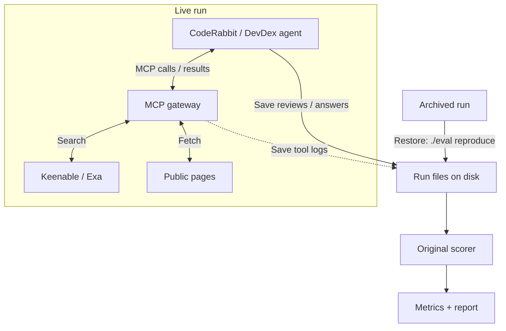

# Keenable Eval For CodeRabbit

[CodeRabbit](https://www.coderabbit.ai/) is an AI agent that reviews pull requests and flags bugs. It [uses Exa Deep Search](https://exa.ai/customers/coderabbit) to verify findings against external documentation.

This repository compares [Keenable](https://keenable.ai/) and [Exa](https://exa.ai/) for CodeRabbit reviews and a separate documentation-retrieval task:

- CodeRabbit reviews: [Martian](https://github.com/withmartian/code-review-benchmark).
- Agent documentation retrieval: [DevDex](https://github.com/firecrawl/benchmark-devdex).

## Results

### Martian: code-review quality

I start with Martian because [CodeRabbit publicly reports results on it](https://www.coderabbit.ai/blog/coderabbit-tops-martian-code-review-benchmark). For a quick pilot, I use 10 of the 50 offline PRs.

Each PR was reviewed once in four modes: native search, no search, Keenable MCP and Exa Auto MCP (40 reviews).

| Search | Core F2 ↑ | Precision ↑ | Recall ↑ |
|---|---:|---:|---:|
| Native | 44.2% | 37.1% | 46.4% |
| None | **59.6%** | **46.2%** | **64.3%** |
| Keenable MCP | 54.4% | 45.7% | 57.1% |
| Exa MCP | 42.8% | 32.5% | 46.4% |

**No search scored highest overall, but this small pilot does not establish a reliable winner.** [Pre-run screening](docs/martian-provenance.md) classified 8/10 PRs as mainly repository-local; these account for the no-search advantage over Keenable. On the two potentially documentation-dependent PRs, Keenable found 7/9 reference issues, versus 6/9 without search and 4/9 for both native and Exa MCP. Two PRs and one review per mode cannot establish that search caused the difference. [Metrics](results/martian-metrics.csv).

All eight fixed-issue controls were also graded: native, Keenable and Exa re-flagged 0/2 repaired issues; no search re-flagged 1/2. These small diagnostics remain separate from benchmark scores. All 20 main MCP reviews used search. [Control and attribution details](docs/martian-provenance.md#fixed-issue-controls).

### DevDex: documentation retrieval

[Firecrawl's DevDex](https://github.com/firecrawl/benchmark-devdex) tests search more directly: the agent must retrieve documentation for a developer's question. Recall@10 checks whether the reference URL appears among its first 10 citations.

30 questions per provider, the same Claude Opus 4.8 agent, one repeat. All 60 episodes completed.

| Search | Reference source found, recall@10 ↑ | Median task time ↓ |
|---|---:|---:|
| Exa Auto | **10/30 (33.3%)** | 20.3 s |
| Keenable Pro | 9/30 (30.0%) | **17.2 s** |

**No demonstrated Keenable quality improvement:** one fewer source found, with a lower median task time. This small, single-repeat pilot measures URL retrieval, not answer correctness; agent-generated queries differ, so timing does not isolate provider latency. [Metrics](results/metrics.csv).

## How to run

Requires Docker with Compose 2.24+.

### Reproduce recorded results

1. Clone the repository and enter it:

   ```sh
   git clone https://github.com/Alpus/keenable-search-eval.git
   cd keenable-search-eval
   ```

2. Rebuild the published results:

   ```sh
   ./eval reproduce
   ```

3. Read the verified reports in `runs/reproduced/`.

### Run fresh experiments

1. Run `./eval setup`. Fill `.env` with `GITHUB_TOKEN`, `KEENABLE_API_KEY`, `EXA_API_KEY` and `ANTHROPIC_API_KEY`. The accounts need [the required permissions and credits](docs/usage.md#fresh-runs).
2. Run `./eval run-all` to prepare private repositories, MCP tokens and the HTTPS tunnel.
3. When prompted, follow `.gateway/coderabbit-setup.md` to install CodeRabbit, save both MCP connections and assign the repositories to a Review scope. Follow the [dashboard checklist](docs/usage.md#unavoidable-coderabbit-dashboard-steps) for exact settings.
4. Confirm settings and quota in the terminal. Keep Docker and the command running while it executes and grades both benchmarks.
5. Read reports in `runs/<run_id>/`.

## Details

### Commands

| Action | Command |
|---|---|
| Inspect resolved inputs / preview schedule | `./eval config CONFIG` / `./eval plan CONFIG` |
| Run or resume one configured, quota-approved suite | `./eval run CONFIG` |
| Run all with custom presets | `./eval run-all DEVDEX_CONFIG MARTIAN_CONFIG CONTROLS_CONFIG` |
| Inspect progress / stop containers | `./eval status` / `./eval stop` |
| Rebuild a current run's report / verify code | `./eval report RUN_ID` / `./eval check` |

### Configure an experiment

1. Copy a `configs/` preset and assign a new run ID.
2. Set models, search modes, limits, seed and repeats. Protocol changes require smoke-test qualification; see [configuration requirements](docs/usage.md#quota-and-configuration).
3. Inspect resolved inputs with `./eval config CONFIG` and preview tasks with `./eval plan CONFIG` before running.

Inputs and evidence are saved in `runs/<run_id>/`. Fresh Martian presets allow 10 concurrent reviews and at most 10 review events per hour. DevDex runs sequentially.

### Resume an experiment

1. Check whether the original runner is still active before starting another command.
2. Preserve the run files and configuration, resolve the interruption, then repeat the original command. Follow the [resume checklist](docs/usage.md#resume-or-handoff) for uncertain reviews or grading failures.

For runs that must survive tunnel restarts, set a stable `PUBLIC_MCP_URL` before the first launch.

### Architecture and extension

Add benchmarks through `src/search_eval/suites/` and the registry in `core.py`, using existing task kinds. [File structure](docs/architecture.md) · [Full commands and methodology](docs/usage.md).



The runner saves configuration, reviews/answers, tool logs and judge responses. CodeRabbit uses this gateway only in MCP modes; fetch uses my shared page reader.

`./eval reproduce` restores the archived files and rebuilds scores and reports.
