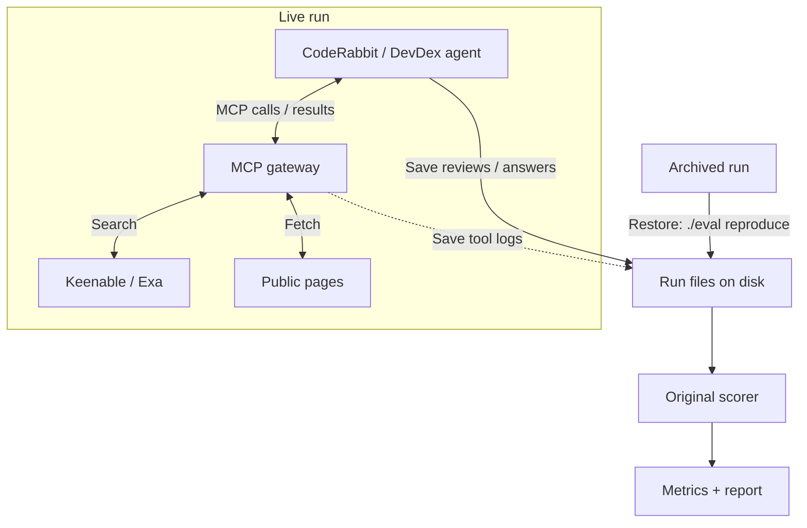

# Keenable Eval For CodeRabbit

[CodeRabbit](https://www.coderabbit.ai/) is an AI agent that reviews pull requests and flags bugs. It [uses Exa Deep Search](https://exa.ai/customers/coderabbit) to verify findings against external documentation.

This repository compares [Keenable](https://keenable.ai/) and [Exa](https://exa.ai/) for CodeRabbit reviews and a separate documentation-retrieval task:

- CodeRabbit reviews: [Martian](https://github.com/withmartian/code-review-benchmark).
- Agent documentation retrieval: [DevDex](https://github.com/firecrawl/benchmark-devdex).

## Results

### Martian: code-review quality

We start with Martian because [CodeRabbit publicly reports results on it](https://www.coderabbit.ai/blog/coderabbit-tops-martian-code-review-benchmark). For a quick pilot, we use 10 of the 50 offline PRs.

Each PR was reviewed once in four modes: native search, no search, Keenable MCP and Exa Auto MCP (40 reviews).

| Search | Core F2 ↑ | Precision ↑ | Recall ↑ |
|---|---:|---:|---:|
| Native | 44.2% | 37.1% | 46.4% |
| None | **59.6%** | **46.2%** | **64.3%** |
| Keenable MCP | 54.4% | 45.7% | 57.1% |
| Exa MCP | 42.8% | 32.5% | 46.4% |

**No search scored highest overall, but this small pilot does not establish a reliable winner.** [Pre-run screening](docs/martian-provenance.md) classified 8/10 PRs as mainly repository-local; these account for the no-search advantage over Keenable. On the two potentially documentation-dependent PRs, Keenable found 7/9 reference issues, versus 6/9 without search and 4/9 for both native and Exa MCP. Two PRs and one review per mode cannot establish that search caused the difference. [Metrics](results/martian-metrics.csv).

All eight fixed-issue controls were also graded: native, Keenable and Exa re-flagged 0/2 repaired issues; no search re-flagged 1/2. These small diagnostics remain separate from benchmark scores. All 20 main MCP reviews used search. [Control and attribution details](docs/martian-provenance.md#fixed-issue-controls).

### DevDex: documentation retrieval

[Firecrawl's DevDex](https://github.com/firecrawl/benchmark-devdex) tests search more directly: the agent must retrieve documentation for a developer's question. Recall@10 checks whether the reference URL appears among its first 10 citations.

30 questions per provider, the same Claude Opus 4.8 agent, one repeat. All 60 episodes completed.

| Search | Reference source found, recall@10 ↑ | Median task time ↓ |
|---|---:|---:|
| Exa Auto | **10/30 (33.3%)** | 20.3 s |
| Keenable Pro | 9/30 (30.0%) | **17.2 s** |

**No demonstrated Keenable quality improvement:** one fewer source found, with a lower median task time. This small, single-repeat pilot measures URL retrieval, not answer correctness; agent-generated queries differ, so timing does not isolate provider latency. [Metrics](results/metrics.csv).

## How to run

Requires Docker with Compose 2.24+ and a POSIX shell (WSL on Windows).

**Reproduce recorded results:**

1. Clone the repository and enter it:

   ```sh
   git clone https://github.com/Alpus/keenable-search-eval.git
   cd keenable-search-eval
   ```

2. Rebuild the published results:

   ```sh
   ./eval reproduce
   ```

3. Find the verified outputs in `runs/reproduced/`: DevDex, 40 scored Martian reviews and eight controls. No keys or accounts are needed; replay runs offline after building.

**Run fresh experiments:**

1. Run `./eval setup` and fill `.env` with `GITHUB_TOKEN`, `KEENABLE_API_KEY`, `EXA_API_KEY` and `ANTHROPIC_API_KEY`. Ensure the accounts have the required access and credits.
2. Run `./eval run-all`. It prepares private repositories, MCP tokens and the HTTPS tunnel automatically; no Cloudflare account or CLI is needed.
3. When prompted, follow `.gateway/coderabbit-setup.md`: install CodeRabbit on the generated repositories, save both MCP connections and add them to a Review scope. These dashboard steps have no documented provisioning API.
4. Confirm the saved settings and available quota in the terminal. The runner then executes and grades both benchmarks; use the same command to resume after an interruption.

[Detailed setup and budget requirements](docs/usage.md#fresh-runs).

## Details

| Action | Command |
|---|---|
| Inspect resolved inputs / preview schedule | `./eval config CONFIG` / `./eval plan CONFIG` |
| Run or resume one configured, quota-approved suite | `./eval run CONFIG` |
| Run all with custom presets | `./eval run-all DEVDEX_CONFIG MARTIAN_CONFIG CONTROLS_CONFIG` |
| Inspect progress / stop containers | `./eval status` / `./eval stop` |
| Rebuild a current run's report / verify code | `./eval report RUN_ID` / `./eval check` |

- Copy a `configs/` preset to change models, search modes, limits, seed or repeats. Inputs and evidence are saved in `runs/<run_id>/`.
- Resume with the same command; new experiments need new run IDs. Protocol changes require smoke-test qualification.
- Set a stable `PUBLIC_MCP_URL` for runs that must survive tunnel restarts.

Fresh Martian presets allow 10 concurrent reviews (`limits.max_concurrent_reviews`) and at most 10 review events per hour. DevDex stays sequential. Recorded results used sequential reviews; no live speedup has been measured.

Add benchmarks through `src/search_eval/suites/` and the registry in `core.py`, using existing task kinds. [Full commands and setup](docs/usage.md) · [File structure](docs/architecture.md).



The runner saves configuration, reviews/answers, tool logs and judge responses. CodeRabbit uses this gateway only in MCP modes; fetch uses our shared page reader.

`./eval reproduce` restores the archived files and rebuilds scores and reports. It does not run agents, the gateway or new model calls.
