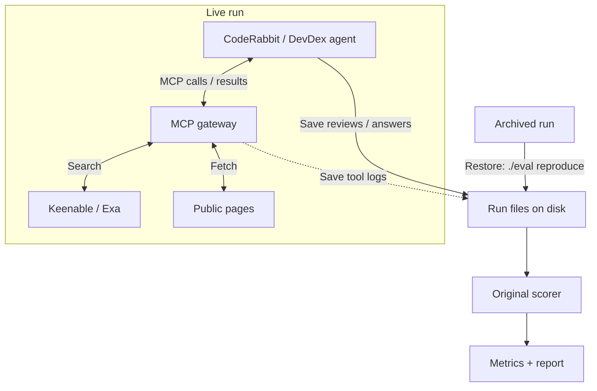

# Keenable Eval For CodeRabbit

[CodeRabbit](https://www.coderabbit.ai/) is an AI agent that reviews pull requests and flags bugs. It [uses Exa Deep Search](https://exa.ai/customers/coderabbit) to verify findings against external documentation.

This repository compares [Keenable](https://keenable.ai/) and [Exa](https://exa.ai/) for CodeRabbit reviews and a separate documentation-retrieval task:

- CodeRabbit reviews: [Martian](https://github.com/withmartian/code-review-benchmark).
- Agent documentation retrieval: [DevDex](https://github.com/firecrawl/benchmark-devdex).

## Results

**Keenable shows no clear advantage across the two benchmarks.**

- **Martian:** Keenable scored 59.8% Core F2 versus Exa’s 58.6%.
- **DevDex:** Keenable found 9/30 reference URLs versus Exa’s 10/30, with median task times of 17.2 s and 20.3 s, respectively.

### Martian: search-focused reviews

Start with Martian because [CodeRabbit reports results on it](https://www.coderabbit.ai/blog/coderabbit-tops-martian-code-review-benchmark). From its 50 offline PRs, I manually selected 11 with plausible dependence on external documentation and reviewed each once in four modes.

| Search | Reference issues found | Unmatched findings | Core F2 |
|---|---:|---:|---:|
| Native | 28/47 | 15 | 60.6% |
| None | **30/47** | 20 | **63.0%** |
| Keenable MCP | **30/47** | 33 | 59.8% |
| Exa Auto MCP | 28/47 | 23 | 58.6% |

*Core F2 = 5 × found / (5 × found + 4 × missed + unmatched).*

Keenable found:

- **30 reference issues**, versus Exa’s 28 and no search’s 30.
- **Four matches gained and four lost versus no search.** Retrieved framing documentation supports one gain; a CSS issue was missed despite a relevant search result.
- **Documentation-supported extras:** an iframe-source check and a Redis key-type migration warning.
- **Extras likely due to contamination:** search found spoilers for a [missing fetch timeout](https://github.com/AI-Code-Review-Evals/claude_code-cal_dot_com/pull/7), [incorrect ASN.1 sequence lengths and integer truncation](https://github.com/AI-Code-Review-Evals/claude_code-keycloak/pull/3). It also fetched existing reviews for [Sentry 93824](https://github.com/AI-Code-Review-Evals/claude_code-sentry/pull/6) and [Sentry Greptile 1](https://github.com/AI-Code-Review-Evals/claude_code-sentry/pull/2).

Any isolated gains did not translate into a consistent improvement in these results.

*Reviews: CodeRabbit (model undisclosed). Judge: Claude Opus 4.5.*

### Additional Martian pilot

I also tested a seeded, source-balanced sample of 10 of the 50 offline PRs because reviews took a long time on the trial plan.

| Search | Reference issues found | Unmatched findings | Core F2 |
|---|---:|---:|---:|
| Native | 13/28 | 22 | 44.2% |
| None | **18/28** | 21 | **59.6%** |
| Keenable MCP | 16/28 | 19 | 54.4% |
| Exa Auto MCP | 13/28 | 27 | 42.8% |

Scores were lower in this pilot, but the different PR sample makes this weak evidence.

### DevDex: documentation retrieval

[DevDex](https://github.com/firecrawl/benchmark-devdex) checks whether an agent retrieves the reference documentation URL among its first 10 citations. I ran the same agent on 30 questions per provider, once each.

| Search | Reference URLs found | Median task time |
|---|---:|---:|
| Exa Auto | **10/30** | 20.3 s |
| Keenable Pro | 9/30 | **17.2 s** |

Keenable found one fewer reference URL and had a lower median task time. This measures URL retrieval, not answer correctness; different agent queries mean time is not a pure provider-latency comparison.

*Agent: Claude Opus 4.8 for both providers.*

## How to run

Requires Docker with Compose 2.24+.

### Reproduce recorded results

1. Clone the repository and enter it:

   ```sh
   git clone https://github.com/Alpus/keenable-search-eval.git
   cd keenable-search-eval
   ```

2. Rebuild the published results:

   ```sh
   ./eval reproduce
   ```

3. Read the verified reports in `runs/reproduced/`.

### Run fresh experiments

1. Run `./eval setup`. Fill `.env` with `GITHUB_TOKEN`, `KEENABLE_API_KEY`, `EXA_API_KEY` and `ANTHROPIC_API_KEY`. The accounts need [the required permissions and credits](docs/usage.md#fresh-runs).
2. Run `./eval run-all` to prepare private repositories, MCP tokens and the HTTPS tunnel.
3. When prompted, follow `.gateway/coderabbit-setup.md` to install CodeRabbit, save both MCP connections and assign the repositories to a Review scope. Follow the [dashboard checklist](docs/usage.md#unavoidable-coderabbit-dashboard-steps) for exact settings.
4. Confirm settings and quota in the terminal. Keep Docker and the command running while it executes and grades both benchmarks.
5. Read reports in `runs/<run_id>/`.

## Details

### Commands

| Action | Command |
|---|---|
| Inspect resolved inputs / preview schedule | `./eval config CONFIG` / `./eval plan CONFIG` |
| Run or resume one configured, quota-approved suite | `./eval run CONFIG` |
| Run all with custom presets | `./eval run-all DEVDEX_CONFIG MARTIAN_CONFIG CONTROLS_CONFIG` |
| Inspect progress / stop containers | `./eval status` / `./eval stop` |
| Rebuild a current run's report / verify code | `./eval report RUN_ID` / `./eval check` |

### Configure an experiment

1. Copy a `configs/` preset and assign a new run ID.
2. Set models, search modes, limits, seed and repeats. Protocol changes require smoke-test qualification; see [configuration requirements](docs/usage.md#quota-and-configuration).
3. Inspect resolved inputs with `./eval config CONFIG` and preview tasks with `./eval plan CONFIG` before running.

Inputs and evidence are saved in `runs/<run_id>/`. Fresh Martian presets allow 10 concurrent reviews and at most 10 review events per hour. DevDex runs sequentially.

### Resume an experiment

1. Check whether the original runner is still active before starting another command.
2. Preserve the run files and configuration, resolve the interruption, then repeat the original command. Follow the [resume checklist](docs/usage.md#resume-or-handoff) for uncertain reviews or grading failures.

For runs that must survive tunnel restarts, set a stable `PUBLIC_MCP_URL` before the first launch.

### Architecture and extension

Add benchmarks through `src/search_eval/suites/` and the registry in `core.py`, using existing task kinds. [File structure](docs/architecture.md) · [Full commands and methodology](docs/usage.md).



The runner saves configuration, reviews/answers, tool logs and judge responses. CodeRabbit uses this gateway only in MCP modes; fetch uses my shared page reader.

`./eval reproduce` restores the archived files and rebuilds scores and reports.
