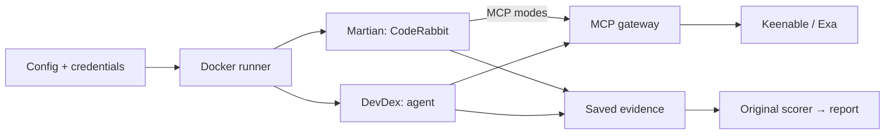

# Developer Search Eval

## About

Compare search providers on two tasks: CodeRabbit reviews (Martian) and an agent's documentation retrieval (DevDex). Both retain their original scorers.

## Results

### Martian: code-review quality

[CodeRabbit publicly reports Martian results](https://www.coderabbit.ai/blog/coderabbit-tops-martian-code-review-benchmark), emphasizing its online benchmark. We use 10 PRs from the separate offline benchmark, comparing native search, no search, Keenable MCP and Exa MCP.

**Results pending:** 40 scored reviews and 8 controls are not yet complete. Primary metric: Core F2 (higher is better, recall weighted more than precision).

Search sensitivity is unproven: [pre-run screening](docs/martian-provenance.md) classified 8/10 PRs as repository-local and only 2 as plausibly documentation-dependent. Similar scores would not establish equivalent search quality.

### DevDex: documentation retrieval

[Firecrawl's DevDex](https://github.com/firecrawl/benchmark-devdex) tests search more directly: the agent must retrieve documentation for a developer's question. Recall@10 checks whether the reference URL appears among its first 10 citations.

30 questions per provider, the same Claude Opus 4.8 agent, one repeat. All 60 episodes completed.

| Search | Reference source found, recall@10 ↑ | Median task time ↓ |
|---|---:|---:|
| Exa Auto | **10/30 (33.3%)** | 20.3 s |
| Keenable Pro | 9/30 (30.0%) | **17.2 s** |

**No demonstrated Keenable quality improvement:** one fewer source found, with a lower median task time. This small, single-repeat pilot measures URL retrieval, not answer correctness; agent-generated queries differ, so timing does not isolate provider latency. [Metrics](results/metrics.csv).

## How to run

Requires Docker with Compose 2.24+ and a POSIX shell (WSL on Windows). Reproduce recorded results:

```sh
git clone https://github.com/Alpus/keenable-search-eval.git
cd keenable-search-eval
./eval reproduce
```

No keys, accounts, agent skills or tunnel setup. After building, replay runs offline and verifies output hashes in `runs/reproduced/`. Currently includes DevDex only.

For **fresh live runs** of both benchmarks:

```sh
./eval setup
# Fill .env: GITHUB_TOKEN, KEENABLE_API_KEY, EXA_API_KEY, ANTHROPIC_API_KEY.
./eval run-all
```

Repositories, tokens and the HTTPS tunnel are automatic; no Cloudflare account or CLI needed. Follow `.gateway/coderabbit-setup.md` for CodeRabbit App/MCP/scope setup, then confirm quota. These dashboard steps have no documented provisioning API. [Access and budget requirements](docs/usage.md#fresh-runs).

## Details

| Action | Command |
|---|---|
| Inspect resolved inputs / preview schedule | `./eval config CONFIG` / `./eval plan CONFIG` |
| Run or resume one configured, quota-approved suite | `./eval run CONFIG` |
| Run all with custom presets | `./eval run-all DEVDEX_CONFIG MARTIAN_CONFIG CONTROLS_CONFIG` |
| Inspect progress / stop containers | `./eval status` / `./eval stop` |
| Rebuild a current run's report / verify code | `./eval report RUN_ID` / `./eval check` |

Copy a `configs/` preset to change models, search modes, limits, seed or repeats. Inputs and evidence are saved in `runs/<run_id>/`. Resume with the same command; new experiments need new run IDs. Protocol changes require smoke-test qualification. Set a stable `PUBLIC_MCP_URL` for runs that must survive tunnel restarts.

Add benchmarks through `src/search_eval/suites/` and the registry in `core.py`, using existing task kinds. [Full commands and setup](docs/usage.md) · [File structure](docs/architecture.md).



The gateway exposes search/fetch. Offline replay starts from saved evidence.
